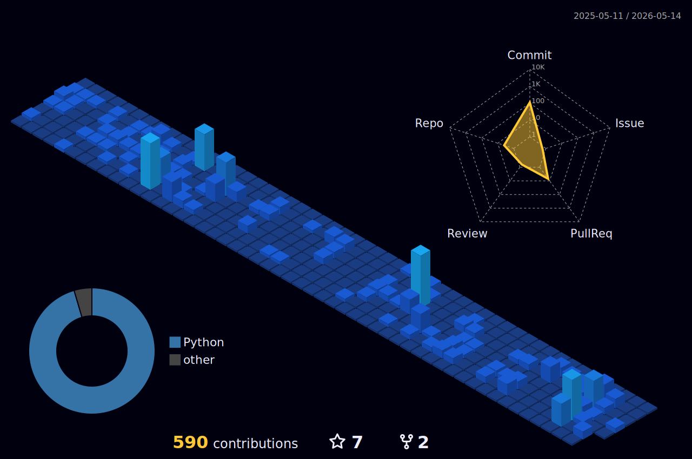

  

## Hansol Kang
### 📄 [View CV / Portfolio](https://messy-snail.github.io/cv/)

I focus on robotics simulation and reinforcement learning, with a secondary interest in computer vision and 3D perception. 
I also have experience building satellite ground station systems and practical web/backend tools.

로봇 시뮬레이션과 강화학습을 중심으로 학습하고 있으며, 컴퓨터 비전과 3D 인식에도 관심이 있습니다. 
위성 지상국 시스템과 웹/백엔드 도구 개발 경험을 바탕으로 실용적이고 신뢰성 있는 시스템을 만드는 데 관심이 있습니다.

## Current Focus

- 🤖 Robotics simulation environments and control workflows
- 🧠 Reinforcement learning for decision making and autonomous behavior
- 👁 Computer vision, 3D perception, and GPU-accelerated processing
- 🛠 Practical systems built from prototyping to reliable operation

## Featured Work

| Area | Problem → Stack → Result |
| --- | --- |
| 🤖 Robotics Simulation & RL | Explore autonomous behavior in simulation → Python, PyTorch, Stable-Baselines3, Isaac Sim, MuJoCo → Practical workflows for control and decision-making experiments |
| 👁 Computer Vision & 3D Perception | Extract reliable spatial information from visual and 3D data → C++, Python, OpenCV, Open3D, CUDA, Qt → Perception tools for robotic vision workflows |
| 🛰 Satellite Ground Station & Web Tools | Build reliable operational software and internal tools → C#, MS-SQL, Vue, Vuetify, FastAPI, Jenkins, Docker → Experience developing practical systems for mission-oriented workflows |

## Tech Stack

### 🤖 Robotics / RL / Simulation

### 👁 Computer Vision / 3D / GPU

### 🌐 Web / Backend / Database

### 🤝 Collaboration / DevOps

### 🖥 System / Environment

## Activity

